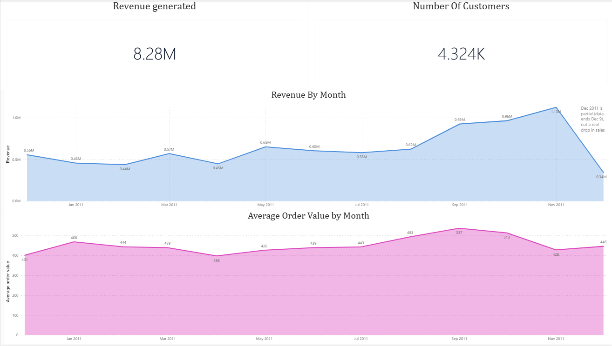
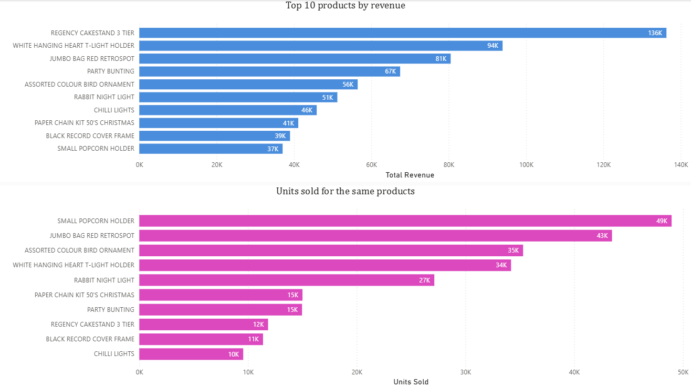
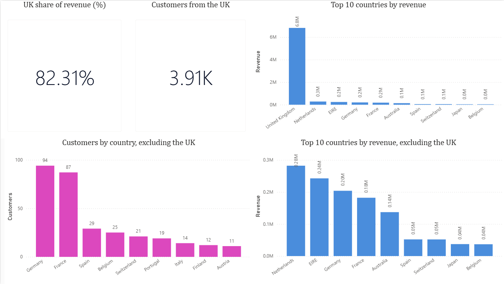
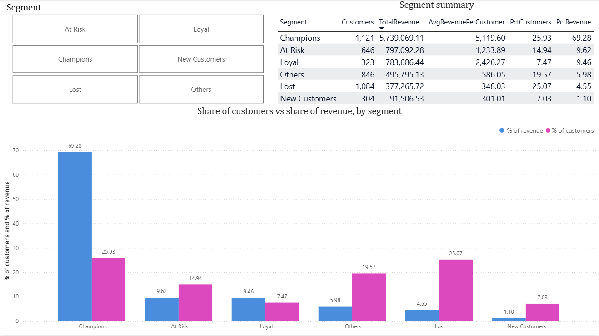

# Online Retail Customer Analytics (SQL + Power BI)

I built this project to practice the full BI workflow: take messy sales data, clean it, answer business questions with SQL, and show the results in a dashboard.

## Business questions

- How does revenue change month to month?
- Which products and countries bring in the most revenue?
- Who are the customers, which ones bring the most revenue, and which ones are at risk of leaving?

## Headline insight

Champions are about 26% of my customers, but they bring about 69% of the revenue. The At Risk group (about 15% of customers) used to buy often and has gone quiet, so it is the best group to win back.

## Tools

- SQLite (DB Browser for SQLite) for cleaning and analysis
- Python (pandas) for one data-prep step, fixing the date format
- Power BI Desktop (free) for the dashboard

## Dashboard

In every page, blue shows revenue and pink shows a different measure (average order value, units sold, or customers), so the colour tells you what you are looking at.

### Page 1: Revenue trend

### Page 2: Products

### Page 3: Countries

### Page 4: Customer segments

## Data

- Source: Online Retail dataset (UCI), a UK online retailer
- 541,910 rows, from 2010-12-01 to 2011-12-09
- Prices are in GBP
- 4,372 customers, 25,900 invoices, and 4,070 products in the raw data

## Data preparation

- InvoiceDate was stored as text like `12/1/10 8:26`, which SQLite date functions cannot read. I converted it to `YYYY-MM-DD HH:MM:SS` with pandas (`online_retail_prepare_dataset.ipynb`).
- I read Customer_ID as a nullable integer, so IDs do not turn into decimals like `17850.0`.
- I loaded the result into a new table, so the raw data stays untouched.
- I checked the reload: the row count and NULL counts matched the raw table.

## Data quality findings

- 135,080 rows (about 25%) have no Customer_ID, so they cannot be used for customer analysis
- 9,288 rows are cancelled invoices (the Invoice starts with "C")
- 1,336 more rows have a negative quantity but are not cancellations. They are stock write-offs (damaged, lost, smashed), and none have a Customer_ID.
- 2,515 rows have a price of 0
- 2 rows have a negative price. They are "Adjust bad debt" accounting entries.

## Cleaning rules

| Rule | Why |
|---|---|
| Keep only rows with a Customer_ID | RFM needs to know who the customer is |
| Keep only Quantity > 0 | Removes cancellations and stock write-offs |
| Keep only Price > 0 | Free items would inflate order counts |
| Remove non-product StockCodes (BANK CHARGES, DOT, M, POST, C2, PADS) | They are fees and adjustments, not products customers chose |
| Remove sales that were fully reversed by a cancellation | See below |

**Reversed sales.** I found that some large sales were cancelled shortly after. For example, invoice 581483 sold 80,995 units, and invoice C581484 reversed the same quantity 12 minutes later for the same customer. The Quantity > 0 filter removes the cancellation, but the original sale stayed in the table as real revenue. That made a product that never really sold the top product, and it inflated two months of revenue.

To fix it, I remove any sale that has a later cancellation with the same customer, the same product, and exactly the opposite quantity (`NOT EXISTS` in SQL).

**Result of cleaning**

- 392,359 rows kept, 149,551 removed (27.59%)
- 4,324 customers
- Total revenue 8,284,415.21 (it was 8,761,066.65 before the reversed-sales fix, so the fix removed 476,651.44, about 5.4%)

## Analysis

### Monthly revenue

- Revenue, customers, orders, and average order value per month
- **2011-12 is a partial month.** The data ends on Dec 9, and there are sales on only 8 days (the other months have sales on about 20 to 27 days). I label it as partial on the dashboard, because it is not a real drop in sales.
- Peak month: Nov 2011 (1,125,520.13). The lowest full month is Feb 2011 (437,291.74).

### Products

- Top 3 products by revenue: Regency Cakestand 3 Tier (about 136K), White Hanging Heart T-Light Holder (about 94K), and Jumbo Bag Red Retrospot (about 81K)
- Revenue and units tell different stories. The Regency Cakestand is first by revenue but sold only about 12K units, so it earns roughly 11 per unit. The Small Popcorn Holder sold the most units (about 49K) but earned only about 37K, which is under 1 per unit.

### Countries

- The UK is 82.31% of revenue, so the country chart is shown with and without the UK
- Outside the UK, the largest markets by revenue are the Netherlands, EIRE, Germany, France, and Australia
- "Unspecified" and "European Community" are not real countries. They are a tiny share of revenue, so I kept them in the data (the totals still reconcile) and excluded them from the country chart.
- Country revenue adds up to the total revenue of the clean table

### Customer segments (RFM)

- **Recency:** days since the last purchase, counted from 2011-12-10 (the last date in the data plus one day), not today's date
- **Frequency:** number of distinct orders
- **Monetary:** total revenue
- Each is scored from 1 to 5 with `NTILE(5)`. Recency is scored in reverse, so a recent customer gets 5.
- I checked the direction: customers with r_score 5 bought 1 to 15 days before the reference date, and customers with m_score 5 spent more than 2,013.

| Segment | Customers | % of customers | Revenue | % of revenue | Avg revenue per customer |
|---|---|---|---|---|---|
| Champions | 1,121 | 25.93% | 5,739,069.11 | 69.28% | 5,119.60 |
| At Risk | 646 | 14.94% | 797,092.28 | 9.62% | 1,233.89 |
| Loyal | 323 | 7.47% | 783,686.44 | 9.46% | 2,426.27 |
| Others | 846 | 19.57% | 495,795.13 | 5.98% | 586.05 |
| Lost | 1,084 | 25.07% | 377,265.72 | 4.55% | 348.03 |
| New Customers | 304 | 7.03% | 91,506.53 | 1.10% | 301.01 |

The segments add up to all 4,324 customers and to the full revenue of the clean table.

## Limitations

- Partial returns are not subtracted, and a repeat purchase of the same quantity could be matched to a cancellation by mistake. Both effects are small.
- Frequency has many ties (most customers have only a few orders), so `NTILE` splits customers with the same number of orders across different scores. The segment rules use ranges of scores to soften this.
- The data covers one year, so I cannot tell seasonal patterns apart from long-term trends.

## Files

- `retail_analysis.sql`: all the SQL, from data checks to segments
- `online_retail_prepare_dataset.ipynb`: the pandas notebook that fixes the date format
- `retail_dashboard.pbix`: the Power BI dashboard (open it with Power BI Desktop)
- `images/`: the four dashboard screenshots shown above
- `datasets/`: the five CSVs used in Power BI (`monthly_revenue.csv`, `top_products.csv`, `country_summary.csv`, `customer_segments.csv`, `segment_summary.csv`). The raw data is not included because of its size, so download it from the UCI source.
